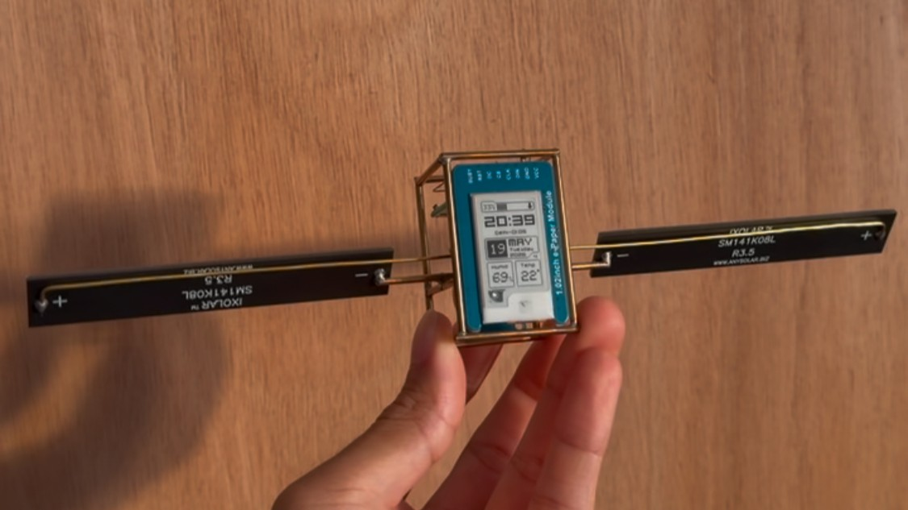
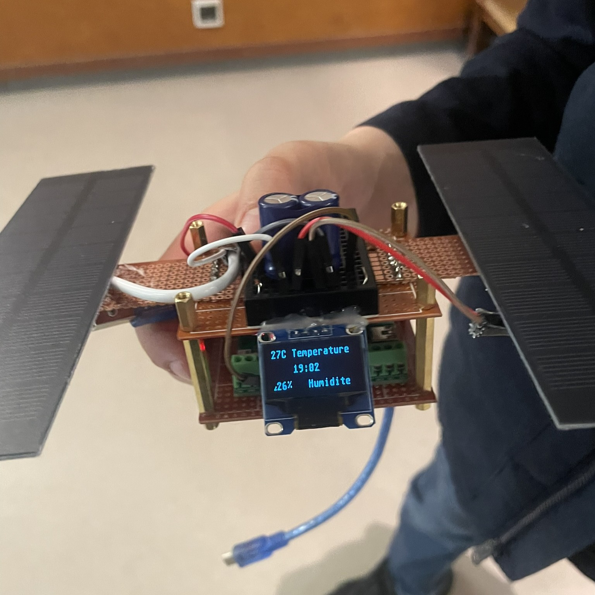
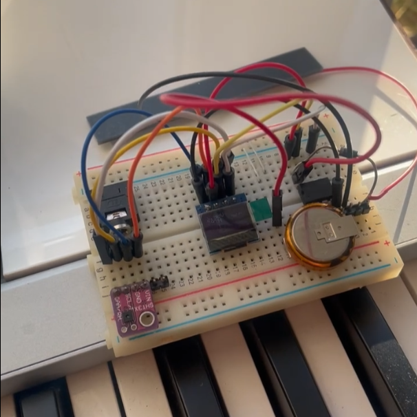
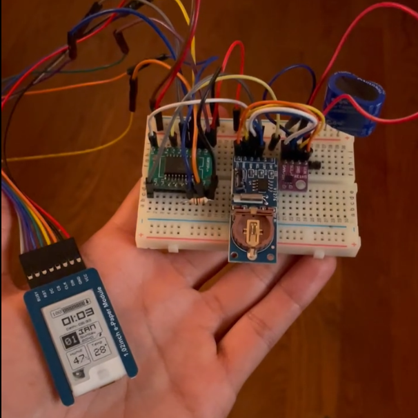
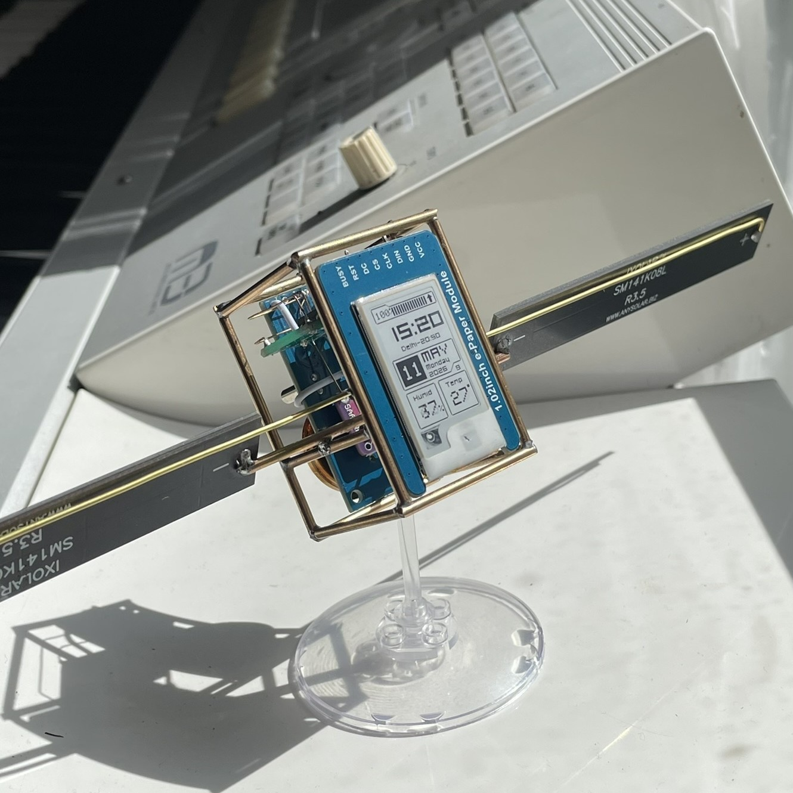
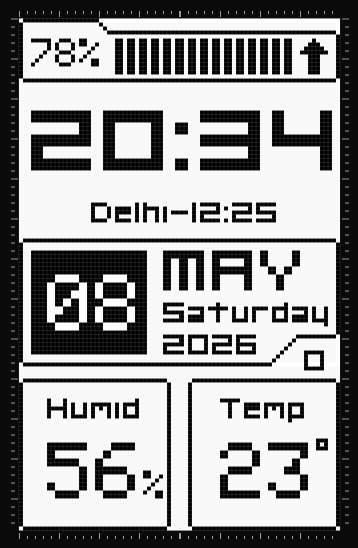
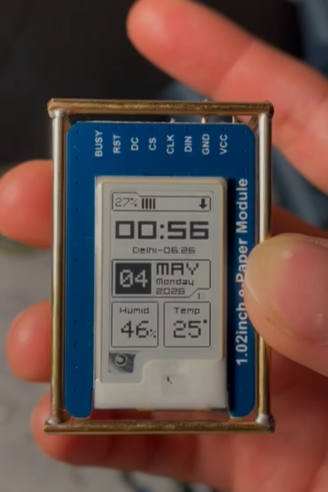
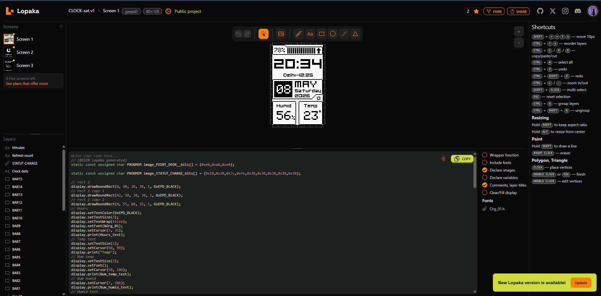
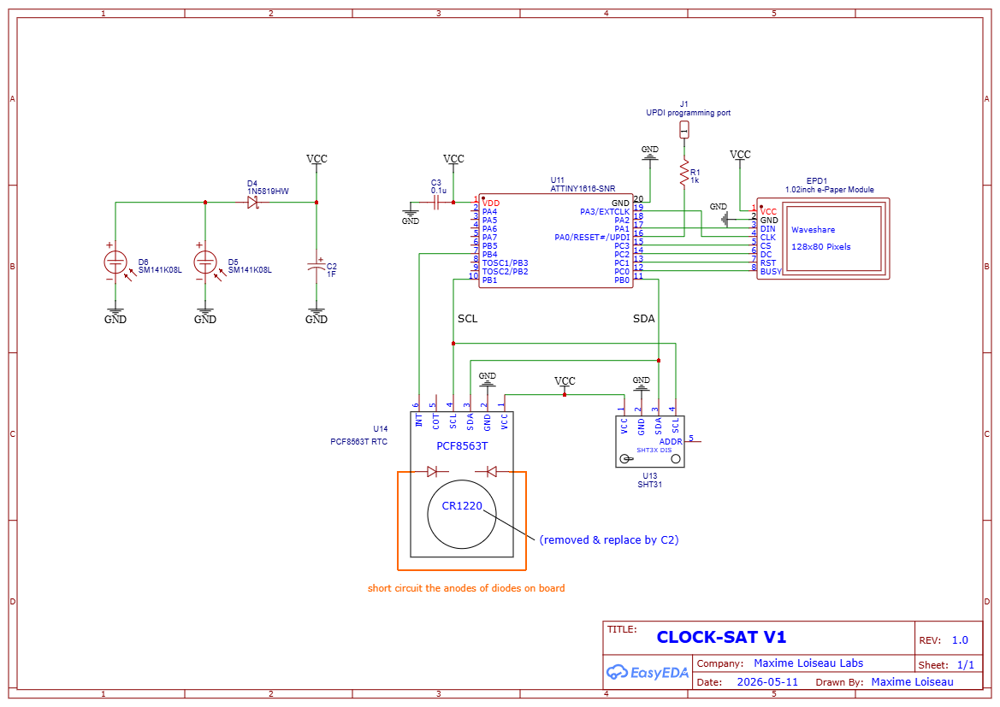
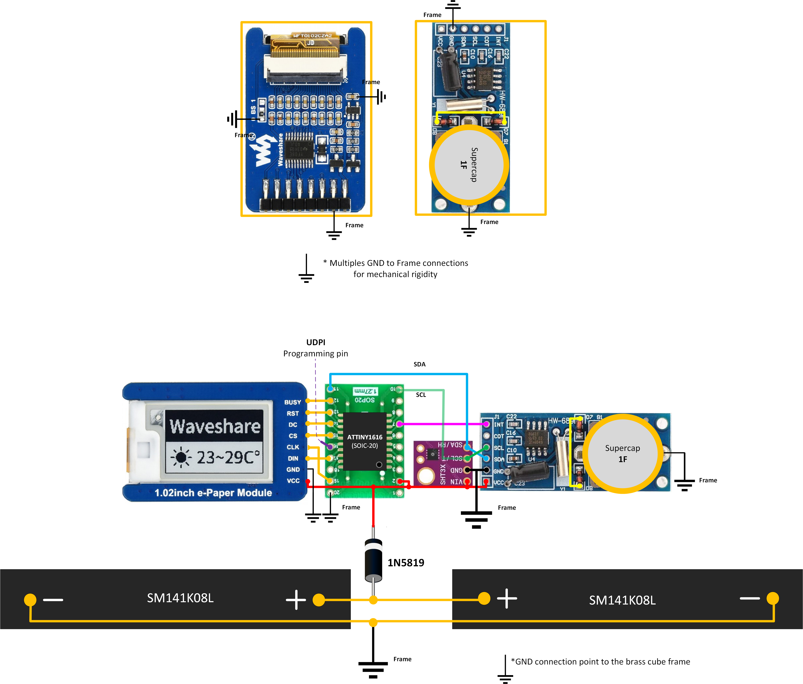

# PIXELSAT DIY
 
**Open-source maker version of PixelSat**, an autonomous, solar-powered
e-paper mini satellite that lives on your desk.
 

 
No battery. No cables. No maintenance. Powered exclusively by solar cells
charging a supercapacitor, PixelSat DIY sits on your desk showing the time,
date, temperature, humidity, and looks like a real satellite while doing it.
 
---
 
## 📖 The story
 
I've been designing electronics for real spacecraft for the past 3 years.
On my desk, I wanted a gadget that echoed my day job: something that felt
like a small satellite, not just a toy.
 
I had long admired [Mohit Bhoite's freeform sculptures](https://bhoite.com/),
those beautiful brass-framed mini satellites where every component is exposed
like architecture. Stunning objects. But I felt something was missing: real
functionality. My idea was to keep that brass wire aesthetic and true solar
autonomy, but add more functionality: a tiny weather station, a clock, a
mini info display.
 
My first prototypes used the small OLED screens that are trendy right now.
I built them mainly for educational electronics workshops with kids. The
OLEDs worked, but their power draw meant I always needed relatively large
solar cells to survive a full day. That was fine for workshops, but I
wanted a compact desk format.
 
Then I discovered e-paper. It ticked every box: ridiculously low
consumption, exactly zero once the image is drawn, no penalty for using
lots of pixels, and beautifully readable in daylight or direct sun.
 
The only issue: most e-paper displays are quite large, not compatible
with a tiny desk satellite. I searched for the smallest e-paper on the
market and finally found one, the Waveshare 1.02" e-paper. Perfect size.
 
PixelSat DIY was born.
 
|  |  |  |  |
|:---:|:---:|:---:|:---:|
| Educational workshops sat | Breadboard v1 (oled) | Breadboard v2 (E-ink) | PixelSat 01 |
 
---
 
## 🛰️ Features
 
**Display**
- Time and date (accurate to the minute)
- Secondary timezone (Delhi by default, configurable)
- Temperature and humidity
- Charge level with charging/discharging indicator
- Discreet partial-refresh counter (a subtle sign the system is alive)
**Autonomy**
- 100% solar-powered, no battery, no cables, ever
- Works on ambient indoor light near a window
- Runs for hours in complete darkness after a full charge
- When power runs low, the SAT enters a low-power sleep state until
  it recharges (charge level 0% = shutdown, resumes automatically)
- Time is retained with an RTC for weeks even without any solar input
**Ease of use**
- Automatic time set at every firmware flash, no manual clock setting
- Automatic European daylight saving time (spring/autumn transitions)
- UI customizable visually via [Lopaka](https://lopaka.app), no C++
  changes needed to redesign your layout
- Fully configurable via `#define` at the top of the firmware file
**Reliability**
- Software watchdog with automatic recovery from I²C lock-ups
- Hysteresis on the low-battery transition (no flickering around the
  threshold)
- Tested across firmware iterations on real hardware
---
 
## UI Design
 
I wanted a display UI that evokes retro-futurist design, like Casio watch
faces for example.
 
So I discovered a useful app called Lopaka, which lets you design a
graphical interface manually without touching code.
 
|  |  |
|:---:|:---:|
| Lopaka UI design | E-ink display UI |
 
The UI is drawn with Lopaka-compatible syntax. Design each screen
separately in Lopaka, then paste the generated code into the matching
function and reflash:
 
- `drawUI()`: the main screen, shown during normal operation
- `drawUISleep()`: the screen shown while the SAT is in its low-power
  SLEEPING state (when charge is too low to refresh normally)

 
Full details: see the [Lopaka app](https://lopaka.app/).
 
---
 
## 🔧 Hardware
 
Core components:
- **MCU**: Microchip ATtiny1616 (SOIC-20)
- **Display**: Waveshare 1.02" e-paper (driver: UC8175, 80×128)
> **⚠️ Sourcing note (as of 2026)**: the Waveshare 1.02" e-paper module
> appears to be out of stock and may be discontinued. Check
> [Waveshare's site](https://www.waveshare.com/) or AliExpress.
>
> If you can't find one, **Good Display** appears to sell a similar display at
> [buy-lcd.com](https://buy-lcd.com/). This could be a drop-in
> replacement requiring no firmware changes, but I haven't tested it
> myself.
 
- **RTC**: NXP PCF8563T with modified board for supercap backup
- **Sensor**: Sensirion SHT31 (temperature + humidity)
- **Power**: 2× SM141K08L solar cells in parallel + 1F to 5F supercapacitor

 

 
| Component | Interface | Key figures |
|---|---|---|
| **ATtiny1616** | SPI + I²C | Down to 0.1 µA in power-down. Runs at 5 MHz here to cut active current |
| **2× SM141K08L** | N/A | 5.53V Voc, 43.9 mA @ Vmpp outdoors. Indoor ambient light yields far less (~100–500× per manufacturer data), hence the parallel pair + supercap buffering |
| **Supercapacitor** | N/A | > 5.5V, between 1F and 5F, choose low ESR / leakage |
| **Waveshare 1.02" e-paper** | SPI | 80×128 px, 0.2 µA deep sleep, ~1.5 mA only during the brief refresh pulse |
| **PCF8563T RTC** | I²C | Sub-µA timekeeping current, 32.768 kHz oscillator |
 
**Assembly step-by-step guide with photos**:
[docs/Step_by_step_tutorial.md](docs/Step_by_step_tutorial.md)
 
---
 
## 🚀 Quick start
 
1. **Build the hardware**, follow the [Build Guide](docs/Step_by_step_tutorial.md)
2. **Configure Arduino IDE**, see [Firmware Configuration](docs/Step_by_step_tutorial.md)
3. **Flash the firmware**:
   - Install [megaTinyCore](https://github.com/SpenceKonde/megaTinyCore)
   - Open `Pixelsat_diy_v1.ino` in Arduino IDE <!-- TO CONFIRM: filename, you wrote Pixelsat01.ino, did you rename it? -->
   - Connect a UPDI programmer
   - No UPDI programmer on hand? See [jtag2updi on Arduino UNO](docs/Step_by_step_tutorial.md)
   - Click Upload
Detailed compilation and flashing steps with screenshots:
[docs/Step_by_step_tutorial.md](docs/Step_by_step_tutorial.md)
 
---
 
## 🎨 Personalize the UI
 
Redesign the layout visually without touching C++:
 
1. Open [Lopaka.app](https://lopaka.app) and create an 80×128 GxEPD2 monochrome project
2. Design your UI (drag-and-drop text, rectangles, bitmaps)
3. Generate the Arduino code
4. Paste it and adapt it into the `drawUI()` and `drawUISleep()` functions
   at the bottom of the .ino file
5. Recompile and flash
---
 
## ⭐ Engineering highlights
 
*How it survives on light alone*
 
**Component selection tuned for microwatts**
- ATtiny1616 draws as little as 0.1 µA typical in full power-down mode
- PCF8563T RTC keeps time on a fraction of a microamp, under 1 µA at 3V
- The e-paper panel is effectively free once an image is drawn: 0.2 µA in
  deep sleep, and only ~1–2 mA for the ~1–2 second refresh pulse itself
- SHT31 sensor sleeps at roughly 1.5 µA and wakes for only ~15 ms per reading
**Underclocking + peripheral shutdown**
- CPU clock dropped to 5 MHz. Active current drops roughly 3–5× compared
  to running at 20 MHz
- Brown-Out Detector fully disabled during sleep, saving ~19 µA that would
  otherwise run continuously
- SPI and I²C are powered down completely between wake cycles (not just
  idled), with unused pins explicitly set to input-disable to kill
  floating-pin leakage
**Sleep-first architecture**
- The PCF8563T's configurable countdown timer decides when to wake the
  MCU, not the ATtiny itself, so the CPU can drop into full Power-Down
  between refreshes while an independent, ultra-low-power clock domain
  handles timing
- Even short waits (e.g. polling the e-paper's BUSY line during a refresh)
  put the CPU in IDLE sleep instead of a busy-loop, saving a few mA on
  every single refresh
- A software watchdog, driven by the tinyAVR's own low-power PIT timer,
  forces a clean reset if an I²C transaction ever locks up. No manual
  reset needed, even after months unattended
**Battery-free energy buffering**
- The ATtiny samples its own VCC via the internal bandgap reference right
  after each wake, to know the supercap voltage, then the ADC is
  immediately powered back down
- A software hysteresis band decides when to enter or leave the
  low-power SLEEPING state, avoiding flicker when light levels hover
  near the threshold
- The supercapacitor stores just enough energy to keep the clock ticking
  for weeks with zero light input
**E-paper-specific tricks**
- Partial refresh is used for the vast majority of updates. The panel
  only redraws pixels that changed, at a fraction of the energy of a full
  redraw
- A full refresh is still forced periodically (per Waveshare's own
  guidance) to avoid ghosting: a deliberate trade-off between energy
  and image quality
- Once drawn, the image costs zero power to keep displaying. E-paper is
  bistable, so most of the SAT's operating time draws nothing at all on
  the display side
---
 
## 🏆 PixelSat DIY vs PixelSat PRO (upcoming commercial version)
 
PixelSat DIY is the open-source, maker-friendly version of the project.
 
A commercial version, **PixelSat**, is planned: a fully assembled product
with additional features and a refined, factory-calibrated enclosure.
The commercial version will be sold as a finished product; PixelSat DIY
will always remain here, free, open, and build-it-yourself.
 
Stay updated to pre-order PixelSat PRO here: [link]
 
---
 
Version history: [CHANGELOG.md](CHANGELOG.md)
 
---
 
## 📜 License
 
**PixelSat DIY** is released under the **Creative Commons
Attribution-NonCommercial-ShareAlike 4.0 International License**
([CC BY-NC-SA 4.0](https://creativecommons.org/licenses/by-nc-sa/4.0/)).
 
You can:
- ✅ Build, modify and use PixelSat DIY for personal, educational, and
  non-commercial purposes
- ✅ Share your modifications on GitHub (fork), under the same license
- ✅ Teach and run workshops based on it
- ✅ Write articles, make videos, share tutorials
You cannot:
- ❌ Sell PixelSat DIY or derived works
- ❌ Use PixelSat DIY (or derivatives) in a commercial product
- ❌ Integrate it into a closed-source project
For commercial licensing, contact Maxime Loiseau Labs.
 
See [LICENSE](LICENSE) for the full legal text.
 
---
 
## 🙏 Credits
 
- **[Mohit Bhoite](https://bhoite.com/)**, inspiration for the
  freeform satellite aesthetic
- **[Waveshare](https://www.waveshare.com/)**, 1.02" e-paper module and
  reference driver (EPD_1in02d.cpp)
- **[Adafruit](https://www.adafruit.com/)**, GFX font format used by Org_01
- **[Lopaka](https://lopaka.app)**, visual e-paper UI editor
- **[Org_01 font](https://www.orgdot.com/aliasfonts)** by Orgdot (public domain)
- **[megaTinyCore](https://github.com/SpenceKonde/megaTinyCore)** by Spence
  Konde, Arduino support for tinyAVR 1-series
---
 
## 👤 Author
 
**Maxime Loiseau Labs**
Space electronics engineer by day, maker by night.
 

