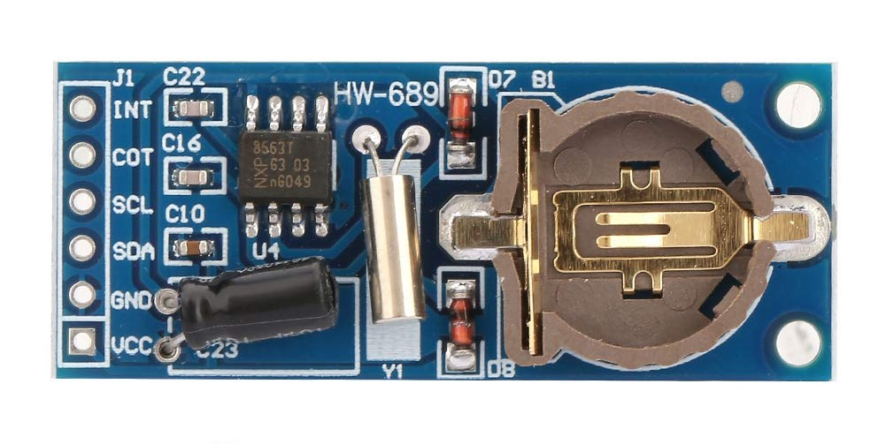
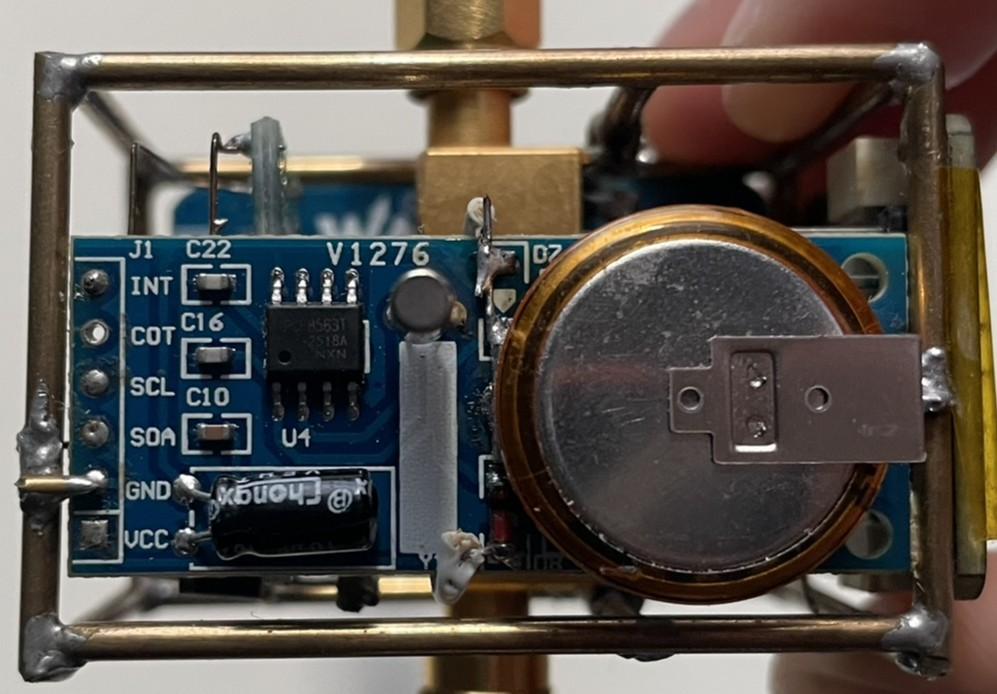
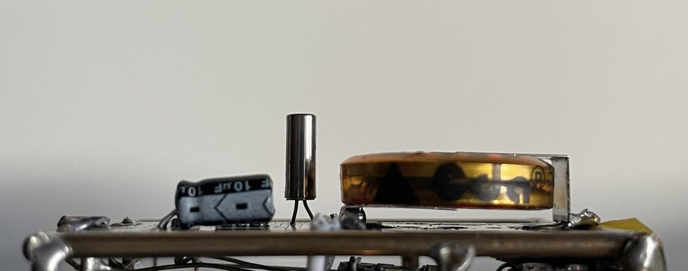
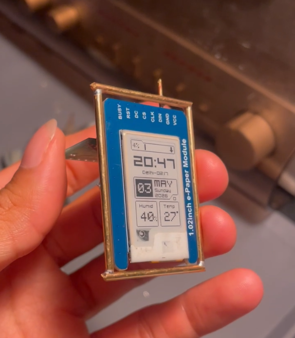
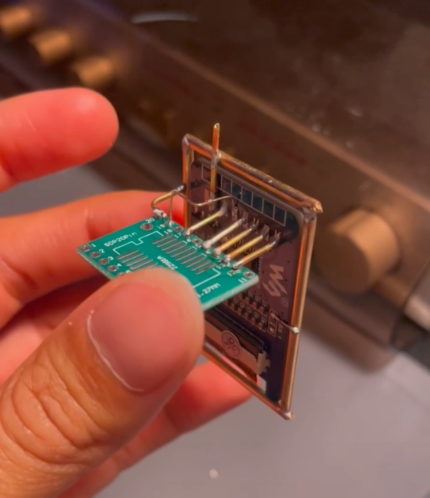
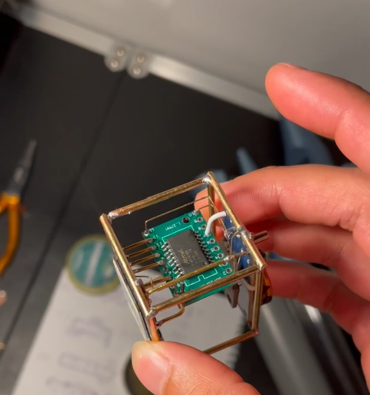
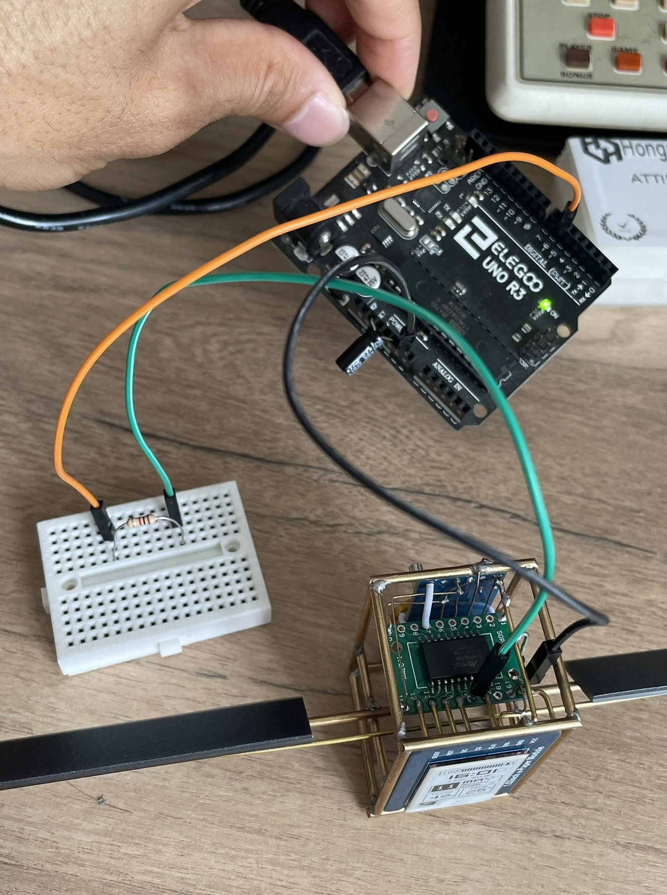
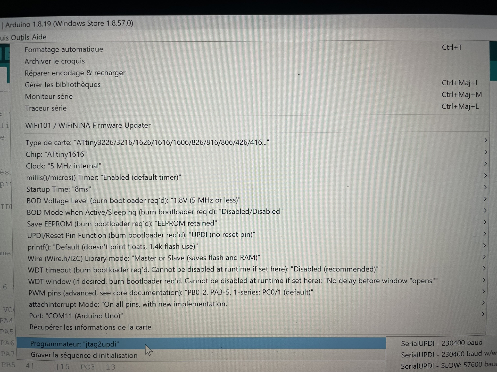

# Hardware & Build Guide
 
This document covers everything needed to build PixelSat DIY: components,
schematic, the RTC supercap modification, assembly, and flashing the
firmware.
 
## Table of contents
 
1. [Components](#components)
2. [Schematic](#schematic)
3. [Test on breadboard first](#test-on-breadboard-first)
4. [RTC supercap modification](#rtc-supercap-modification)
5. [Assembly](#assembly)
6. [Flashing the firmware](#flashing-the-firmware)
---
 
## Components
 
- 1× ATtiny1616 (SOIC-20)
- 1× DIP to SMD adapter PCB for SOIC-20
- 1× 100nF decoupling capacitor (>10V)
- 1× Waveshare 1.02" e-paper module (UC8175), see sourcing note in the
  [README](../README.md#hardware) if unavailable
- 1× PCF8563T RTC module (see [RTC supercap modification](#rtc-supercap-modification))
- 1× SHT31 temperature/humidity sensor
- 2× SM141K08L solar cells
- 1× supercapacitor (5V minimum, 1F to 5F). I use a *1F 5.5V H-type terminal*
  but other formats work.
- 1× 1N5819 or any low-drop-out Schottky diode
- UPDI programmer, or a spare Arduino UNO works (see [Flashing](#flashing-the-firmware))
- Brass rod or brass wire: 2mm, 1.5mm, 0.5mm
- Misc: wires, breadboard, solder, flux...
No exact supplier links, all parts are widely available on Digikey
or AliExpress. Search by part number or description.
 
---
 
## Schematic
 

 
**How does it work?**
 
The MCU talks to the RTC and SHT31 over I²C (2 wires), and to the e-paper
display over SPI (4-wire protocol). The RTC's INT pin wakes the ATtiny1616
from deep sleep every minute.
 
About powering: the solar cells charge the supercapacitor through a diode
(to prevent the supercap discharging back into the solar cells). The
solar cells can produce up to 5V in direct sun.
 
The entire circuit can work down to around 2.3V; this value is limited by
the e-ink screen's minimum VCC. This is a value I tested myself, so it
may vary between components. You may need to tweak the *VCC_PCT_LOW_MV*
value in the code if the e-ink display doesn't work properly.
 
A modification is needed on the RTC module to mount the supercapacitor as
the main VCC rail by bypassing the onboard diodes (see
[RTC supercap modification](#rtc-supercap-modification)).
 
**Which capacitor value?**
 
It depends on your usage. More capacity means more storage, so the SAT
will run longer with no light available (night), but it will also take
longer to charge, especially in a low-light environment.
 
With the 1F capacitor, my SAT runs for about 1-2h in complete darkness.
 
---
 
## Test on breadboard first
 
Before soldering anything permanently, wire the circuit up on a
breadboard with all modules and flash the firmware to confirm everything
works: the display refreshes, the RTC keeps time, the sensor reads
correctly. It's much easier to debug a loose wire than a bad solder joint.
 
I suggest testing first with a regulated 5V or 3.3V supply.
 
Follow the schematic for this step.
 

 
---
 
## RTC supercap modification
 
The PCF8563T module normally ships with a CR1220 coin-cell holder for
backup power. PixelSat DIY replaces that coin cell with a single
supercapacitor to power the entire system, so the RTC keeps time using
the same energy reservoir as the rest of the circuit, no separate battery
to replace, ever.
 

*The RTC module as it ships, before any modification.*
 
### Steps
 
1. Desolder the coin-cell holder.
2. Bend the supercapacitor's pins toward the center.
3. Solder the supercap to the pads of the coin-cell holder. Be careful
   about polarity.
4. Solder a wire to connect the anodes of the two onboard diodes. (D7
   can also be removed and/or short-circuited to eliminate an unnecessary
   voltage drop.)

*The RTC module, top view, after the modification.*
 

*The RTC module, side view, after the modification.*
 
> ⚠️ Double-check supercapacitor polarity before powering on.
 
---
 
## Assembly
 
Follow the assembly drawing below.
 
### Steps
 
1. Desolder the pin connectors of each board.
2. Cut and solder 2mm brass rod to create a frame around the RTC board
   and around the e-ink board. For mechanical rigidity, make sure to
   secure the frame to each board by soldering small wires only where
   GND is present!
3. Connect the ATtiny board to the e-ink board with 1.5mm brass wire,
   according to the drawing.
4. Solder the two frames together with 2mm brass rod to create a cubic
   shape.
5. Connect the SHT31 sensor and I²C bus with 0.5mm brass wire, and
   create a VCC rail that connects all modules' VCC pins.
6. Solder the two solar cells in parallel with 1.5mm brass wire (be
   careful about polarity), then insert the solar unit and solder its
   GND wire to the cubic frame.
7. Connect the Schottky diode between the VCC rail and the solar cell's
   positive rail.
> ⚠️ Double-check the solar cells' and diode's polarity before powering on.
 

*Assembly drawing.*
 

*Step 2, brass frame around the e-ink board.*
 

*Step 3, ATtiny PCB connections.*
 

*Steps 4-5, cubic shape.*
 
[TO ADD: photo of solar cell connections and diode wiring]
 
---
 
## Flashing the firmware
 
### 1. Set up a UPDI programmer
 
The simplest option is a spare Arduino UNO or NANO flashed as a jtag2updi
programmer.
 
Follow megaTinyCore's official guide:
[Building a UPDI programmer](https://github.com/SpenceKonde/megaTinyCore/blob/master/MakeUPDIProgrammer.md)
 
Or this video tutorial:
[UPDI Programmer using Arduino Uno for ATTiny 0-Series 1-Series etc](https://www.youtube.com/watch?v=YOGeoW_QySs)
 
### 2. Wire it to PixelSat
 
| jtag2updi (UNO) | PixelSat (ATtiny) |
|---|---|
| UPDI pin 6 (via 1kΩ to 4.7kΩ resistor) | UPDI pin 16 |
| GND | GND |
| 5V *(only if PixelSat isn't already powered)* | VCC |
 

 
### 3. Install megaTinyCore
 
In Arduino IDE: **File → Preferences → Additional Board Manager URLs**,
add the megaTinyCore URL, then install it via **Tools → Board → Boards
Manager**. Full instructions:
[megaTinyCore installation](https://github.com/SpenceKonde/megaTinyCore/blob/master/Installation.md)
 
### 4. Configure Arduino IDE board settings
 
These settings matter for power consumption and correct operation.
Don't leave them at default:
 
| Setting | Value | Why |
|---|---|---|
| Board | ATtiny3226/3216/1626/1616/1606/826/816/806/426/416 | N/A |
| Chip | ATtiny1616 | N/A |
| Clock | **5 MHz internal** | Cuts active current ~3-5× vs default; nothing in this firmware needs more speed |
| millis()/micros() Timer | Enabled (default timer) | Required, used by `epdWait()` and `epdIdleMs()` |
| Startup Time | 8ms | Safe minimum with BOD enabled |
| BOD Voltage Level | **1.8V (5 MHz or less)** | Lets the system run down to low VCC before reset; the firmware's own hysteresis handles the SLEEPING transition before BOD would ever trigger |
| BOD Mode (Active/Sleep) | Disabled/Disabled | Saves ~20 µA continuous draw; the firmware's software VCC monitoring replaces this |
| Save EEPROM | **EEPROM retained** | Critical: the firmware stores a build hash in EEPROM to auto-set the RTC only on new firmware, not on every flash |
| UPDI/Reset Pin Function | UPDI (no reset pin) | Required for UPDI-only programming (no separate reset button) |
| printf() | Default | Not used, but no cost either way |
| Wire (I²C) Library mode | **Master or Slave** (can switch to **Master Only** to save flash) | PixelSat is always I²C master (RTC, SHT31), never slave |
| WDT timeout | Disabled (recommended) | The firmware implements its own watchdog via RTC.PIT, not the hardware WDT |
| attachInterrupt Mode | On all pins, with new implementation | Required: the RTC INT line is on a pin that needs this mode to wake from deep sleep |
| Port | *(your UPDI programmer's COM port)* | N/A |
| Programmer | jtag2updi | N/A |
 

 
After changing **Clock**, **BOD Voltage**, **BOD Mode**, **Save EEPROM**,
or **UPDI/Reset Pin Function**, you must re-burn the bootloader for the
changes to take effect:
 
**Tools → Burn Bootloader** (takes a few seconds)
 
Then flash the firmware normally.
 
### 5. Flash
 
Open `mini_sat_v1_3.ino` in Arduino IDE <!-- TO CONFIRM: filename, you
wrote Pixelsat01.ino elsewhere, did you rename the file? -->, confirm the
settings above, select the correct Port, and click **Upload**.
 
The code is well commented, so I recommend checking the
*// USER CONFIGURATION* section to adapt settings such as *ENABLE_DST*,
and the secondary timezone via *TZ_OFFSET_MIN* and *TZ_LABEL*.
 